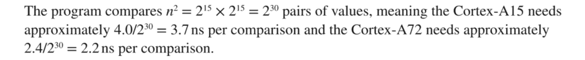
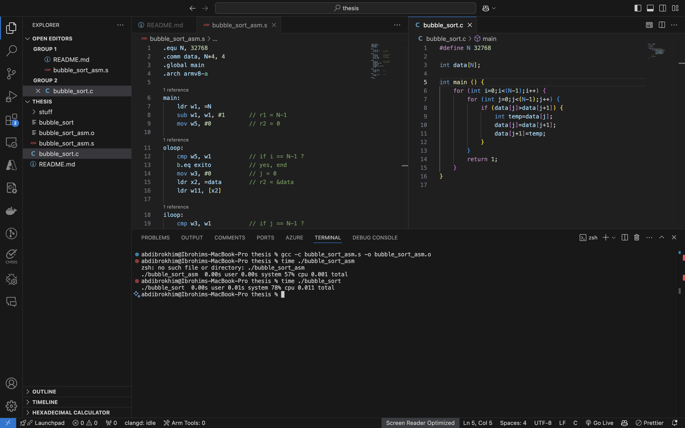
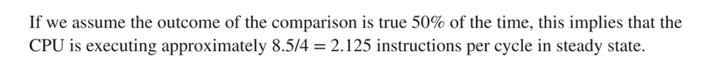

# Code optimization for STM-32 f103/STM-32 F407 Discovery Time and memory

## Literature review

### Using C

compile `bubble_sort.c` file using; 

```bash
gcc bubble_sort.c -03 -o bubble_sort
```

execute and time the program;

```bash
time ./bubble_sort
```

> book says:


### Using Assembly

compile `bubble_sort_asm.s` file using; 

```bash
gcc -c bubble_sort_asm.s -o bubble_sort_asm.o 
```

execute and time the program;

```bash
time ./bubble_sort_asm
```

compare the execution time of the two programs;



> book says:


## References

- Embedded systems. 2nd edition. ARM Programming and Optimization by Jason D. Bakos. [here](https://books.google.co.uz/books?hl=en&lr=&id=NFLSEAAAQBAJ&oi=fnd&pg=PP1&dq=code+optimization+in+embedded+systems+ARM+Cortex-M+microcontrollers&ots=T3i_rewRb5&sig=8zz_aNTTMfCUmMFtyiUifn3w6i0&redir_esc=y#v=onepage&q&f=false)

